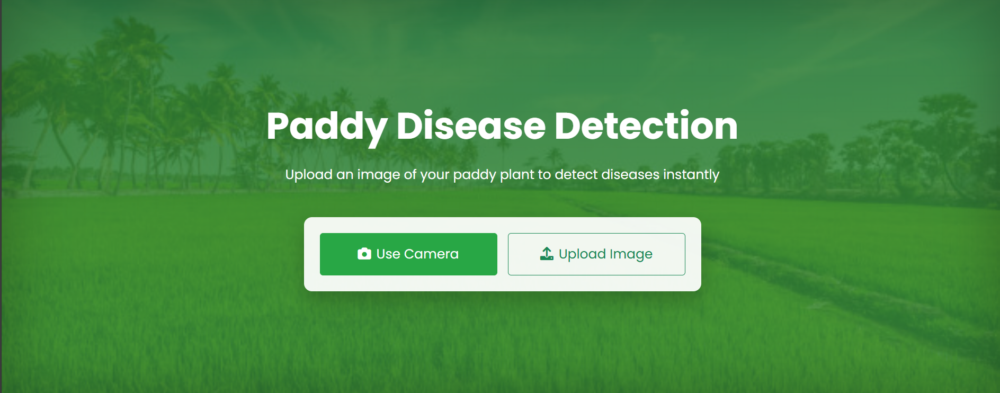
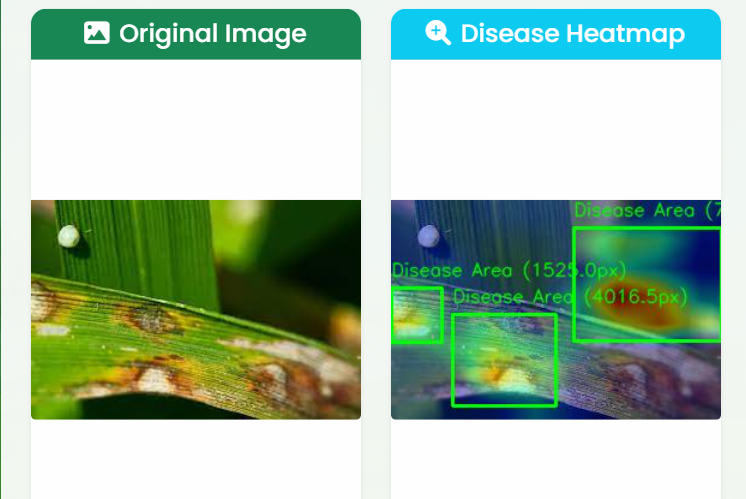
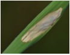
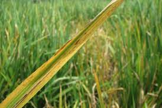
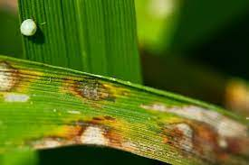
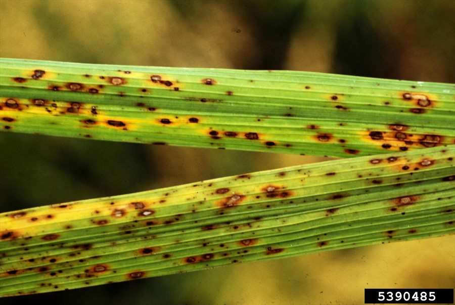
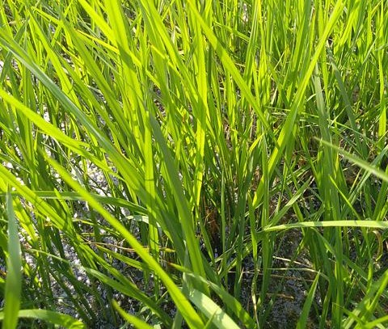
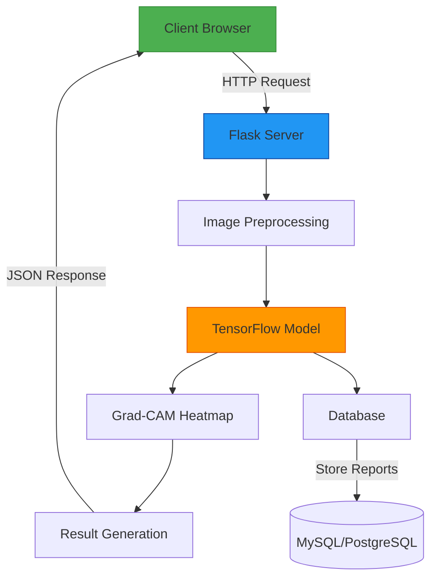

<div align="center">
# 🌱 Plant Disease Detection System
</div>
  
*An AI-powered solution for detecting diseases in rice plants*

## 🚀 Features

- **Accurate Disease Detection**: Identifies common rice plant diseases with high accuracy
- **Heatmap Visualization**: Grad-CAM heatmaps highlight affected areas
- **Confidence Metrics**: Shows prediction confidence levels
- **Responsive Design**: Works on desktop and mobile devices
- **User-Friendly Interface**: Simple upload and results workflow

## 🛠️ Technologies Used


## 📦 Installation

1. Clone the repository
```bash
git clone https://github.com/MOHAN1665/Paddy_Plant_Disease_Prediction_Using_EfficientNetV2.git
cd plant-disease-detection
```
2. Create and activate virtual environment:
```bash
python -m venv venv
source venv/bin/activate  # On Windows use `venv\Scripts\activate
```
3. Install dependencies:
```bash
pip install -r requirements.txt
```
4. Run the application:
```bash
flask run
```
5. Open your browser at ```http://localhost:5000```

## 🖥️ Usage Demo

<div align="center" style="margin: 30px 0;">
  <div style="display: flex; justify-content: center; gap: 40px; flex-wrap: wrap;">
    <div style="flex: 1; min-width: 300px; max-width: 400px; text-align: center;">
      <h4 style="margin-bottom: 15px; color: #2c3e50;">📤 Upload Interface</h4>
      <a href="static/screenshots/upload.png" target="_blank" style="text-decoration: none;">
        
        <p style="font-size: 0.9em; color: #7f8c8d; margin-top: 10px;">
          <i>Click to view full screenshot</i>
        </p>
      </a>
    </div>
    <div style="flex: 1; min-width: 300px; max-width: 400px; text-align: center;">
      <h4 style="margin-bottom: 15px; color: #2c3e50;">📊 Results Page</h4>
      <a href="static/screenshots/results.png" target="_blank" style="text-decoration: none;">
        
        <p style="font-size: 0.9em; color: #7f8c8d; margin-top: 10px;">
          <i>Click to view full screenshot</i>
        </p>
      </a>
    </div>
    
  </div>
</div>

### Step-by-Step Guide:
1. **Upload Page**:
   - Click "Choose File" to select plant image
   - Supported formats: JPG, PNG (max 5MB)
   - Click "Predict" to analyze

2. **Results Page**:
   - View original image + heatmap visualization
   - See disease prediction with confidence percentage
   - Options to:
     - View disease details
     - Report incorrect predictions
     - Upload new image


## 🌿 Supported Diseases

<div align="center">

| Disease Name | Example Image | Description | Confidence Threshold |
|--------------|---------------|-------------|----------------------|
| **Hispa** |  | Caused by leaf miners creating white streaks | >75% |
| **Tungro** |  | Yellow-orange discoloration of leaves | >70% |
| **Blast Disease** |  | Diamond-shaped lesions with gray centers | >80% |
| **Brown Spot** |  | Small brown spots with yellow halos | >65% |
| **Healthy Plant** |  | No disease detected | >90% |

</div>

## 🏗️ Project Architecture


## 📂 Directory Structure
```bash
plant-disease-detector/
├── app.py                # Main Flask application
├── requirements.txt      # Python dependencies
├── README.md             # Project documentation
├── disease_reports.json  # User-submitted disease reports
│
├── static/               # All static assets
│   ├── main.css          # Global styles
│   ├── script.js         # Frontend interactivity
│   ├── examples/         # Sample disease images
│   └── screenshots/      # Application screenshots
│
├── templates/            # Frontend templates
│   ├── index.html        # Main upload interface
│   └── results.html      # Prediction results page
│   └── and other diseases related html files
│
└── models/               # AI Model files
    ├── model.pth         # PyTorch trained weights
    └── model.ipynb       # Jupyter notebooks
```

## 🤝 How to Contribute

We welcome contributions from the community! To help improve this project:

1. **Fork** the repository:  
   [](https://github.com/MOHAN1665/Paddy_Plant_Disease_Prediction_Using_EfficientNetV2/fork)

2. **Create** a feature branch:
   ```bash
   git checkout -b feature/your-feature-name

3. **Commit** your changes:
   ```bash
   git commit -m "Add: your feature description"

4. **Push** to your branch:
   ```bash
   git push origin feature/your-feature-name

5. **Open** a Pull Request with:
   Description of changes
   Screenshots (if applicable)
   Reference to related issues

## 📜 License

```text
MIT License

Copyright (c) [year] [fullname]

Permission is hereby granted, free of charge, to any person obtaining a copy
of this software and associated documentation files (the "Software"), to deal
in the Software without restriction, including without limitation the rights
to use, copy, modify, merge, publish, distribute, sublicense, and/or sell
copies of the Software, and to permit persons to whom the Software is
furnished to do so, subject to the following conditions:

The above copyright notice and this permission notice shall be included in all
copies or substantial portions of the Software.

THE SOFTWARE IS PROVIDED "AS IS", WITHOUT WARRANTY OF ANY KIND, EXPRESS OR
IMPLIED, INCLUDING BUT NOT LIMITED TO THE WARRANTIES OF MERCHANTABILITY,
FITNESS FOR A PARTICULAR PURPOSE AND NONINFRINGEMENT. IN NO EVENT SHALL THE
AUTHORS OR COPYRIGHT HOLDERS BE LIABLE FOR ANY CLAIM, DAMAGES OR OTHER
LIABILITY, WHETHER IN AN ACTION OF CONTRACT, TORT OR OTHERWISE, ARISING FROM,
OUT OF OR IN CONNECTION WITH THE SOFTWARE OR THE USE OR OTHER DEALINGS IN THE
SOFTWARE.
```

## 📬 Contact

**Project Maintainer**:  
[](https://github.com/MOHAN1665)  
[](mailto:pmohankumar854@gmail.com)

**Project Links**:  
[](https://github.com/MOHAN1665/Paddy_Plant_Disease_Prediction_Using_EfficientNetV2)  
[](https://github.com/MOHAN1665/Paddy_Plant_Disease_Prediction_Using_EfficientNetV2/issues)

---

<div align="center" style="margin-top: 20px;">
  <a href="https://github.com/MOHAN1665/Paddy_Plant_Disease_Prediction_Using_EfficientNetV2/stargazers">
    
  </a>
  <a href="https://github.com/MOHAN1665/Paddy_Plant_Disease_Prediction_Using_EfficientNetV2/network/members">
    
  </a>
  <a href="https://github.com/MOHAN1665/Paddy_Plant_Disease_Prediction_Using_EfficientNetV2/blob/main/LICENSE">
    
  </a>
</div>
