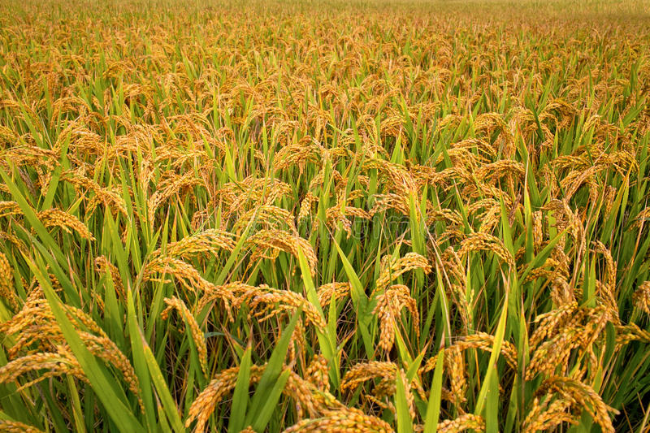

# 🌱 Plant Disease Detection System

  
*An AI-powered solution for detecting diseases in rice plants*

## 🚀 Features

- **Accurate Disease Detection**: Identifies common rice plant diseases with high accuracy
- **Heatmap Visualization**: Grad-CAM heatmaps highlight affected areas
- **Confidence Metrics**: Shows prediction confidence levels
- **Responsive Design**: Works on desktop and mobile devices
- **User-Friendly Interface**: Simple upload and results workflow

## 🛠️ Technologies Used


## 📦 Installation

# 1.Clone the repository
```bash
git clone https://github.com/MOHAN1665/Paddy_Plant_Disease_Prediction_Using_EfficientNetV2.git
cd plant-disease-detection
```
# Create and activate virtual environment
python -m venv venv
source venv/bin/activate  # On Windows use `venv\Scripts\activate`

# Install dependencies
pip install -r requirements.txt

# Run the application
flask run
