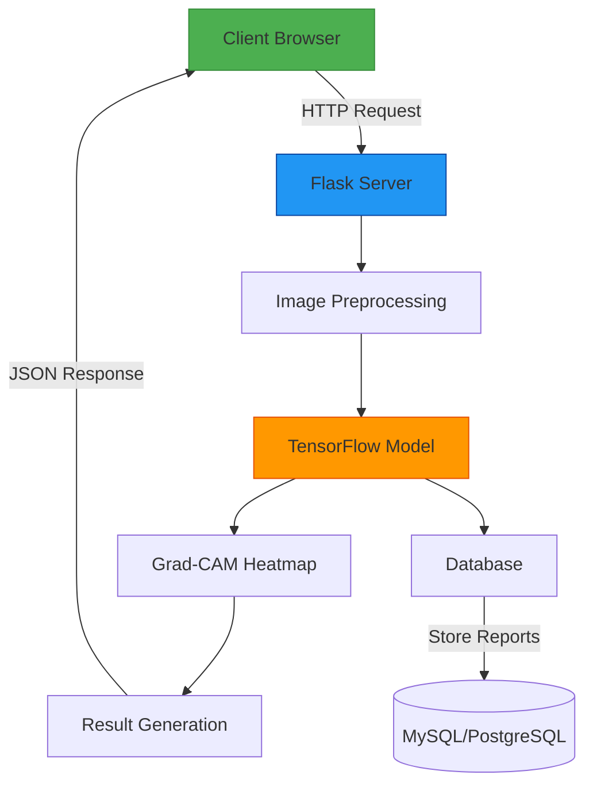

# 🌱 Plant Disease Detection System

  
*An AI-powered solution for detecting diseases in rice plants*

## 🚀 Features

- **Accurate Disease Detection**: Identifies common rice plant diseases with high accuracy
- **Heatmap Visualization**: Grad-CAM heatmaps highlight affected areas
- **Confidence Metrics**: Shows prediction confidence levels
- **Responsive Design**: Works on desktop and mobile devices
- **User-Friendly Interface**: Simple upload and results workflow

## 🛠️ Technologies Used


## 📦 Installation

1. Clone the repository
```bash
git clone https://github.com/MOHAN1665/Paddy_Plant_Disease_Prediction_Using_EfficientNetV2.git
cd plant-disease-detection
```
2. Create and activate virtual environment:
```bash
python -m venv venv
source venv/bin/activate  # On Windows use `venv\Scripts\activate
```
3. Install dependencies:
```bash
pip install -r requirements.txt
```
4. Run the application:
```bash
flask run
```
5. Open your browser at ```http://localhost:5000```

🖥️ Usage Demo
Upload Interface
Upload Screen

Results Page
Results Screen

## 🌿 Supported Diseases

<div align="center">

| Disease Name | Example Image | Description | Confidence Threshold |
|--------------|---------------|-------------|----------------------|
| **Hispa** |  | Caused by leaf miners creating white streaks | >75% |
| **Tungro** |  | Yellow-orange discoloration of leaves | >70% |
| **Blast Disease** |  | Diamond-shaped lesions with gray centers | >80% |
| **Brown Spot** |  | Small brown spots with yellow halos | >65% |
| **Healthy Plant** |  | No disease detected | >90% |

</div>

## 🏗️ Project Architecture


